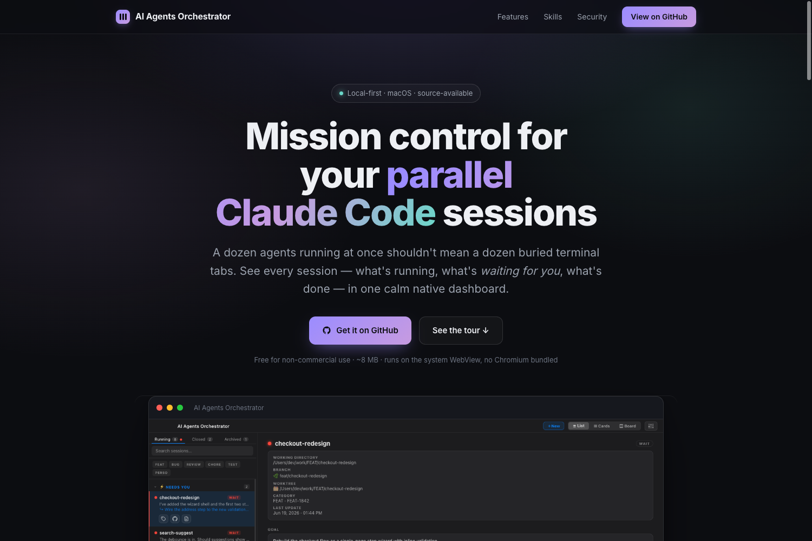
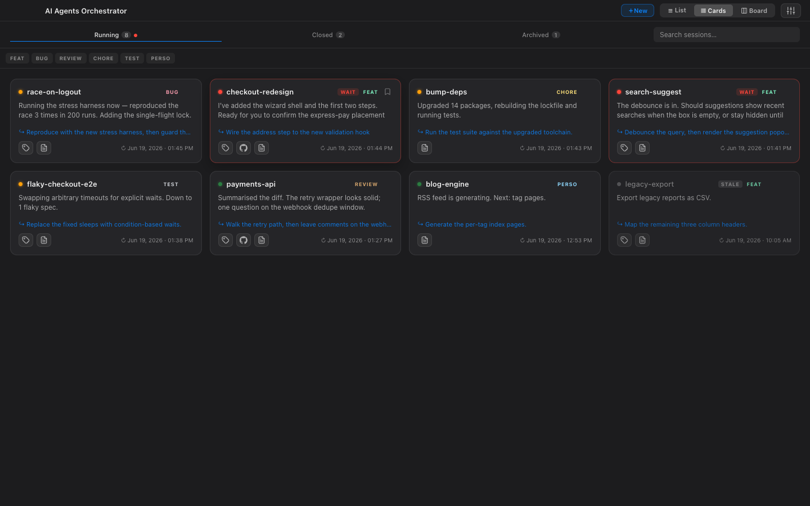
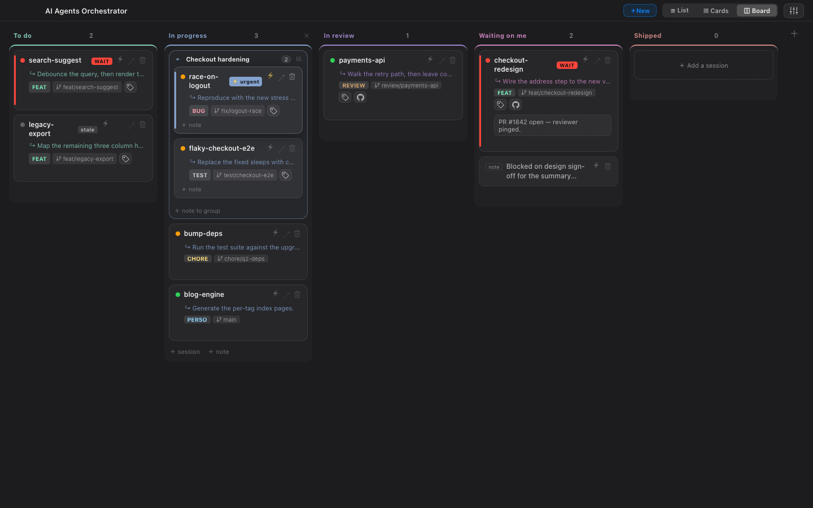
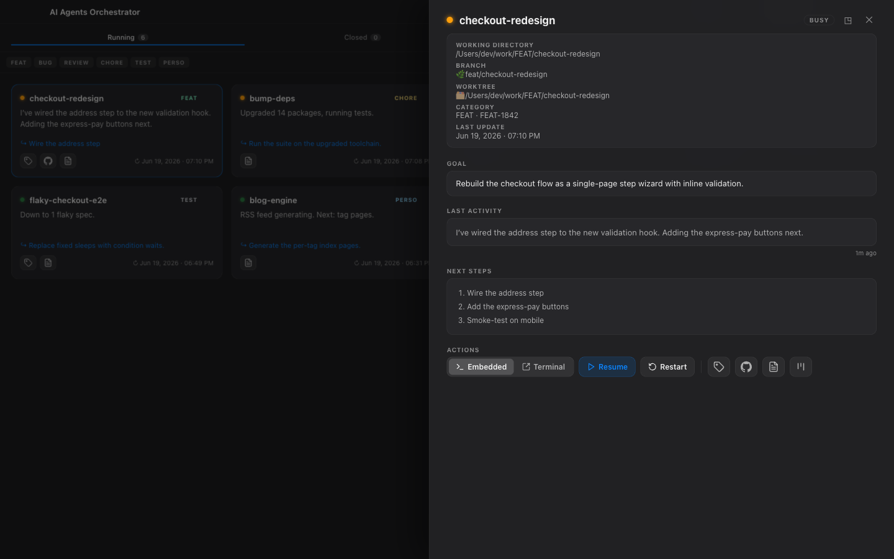
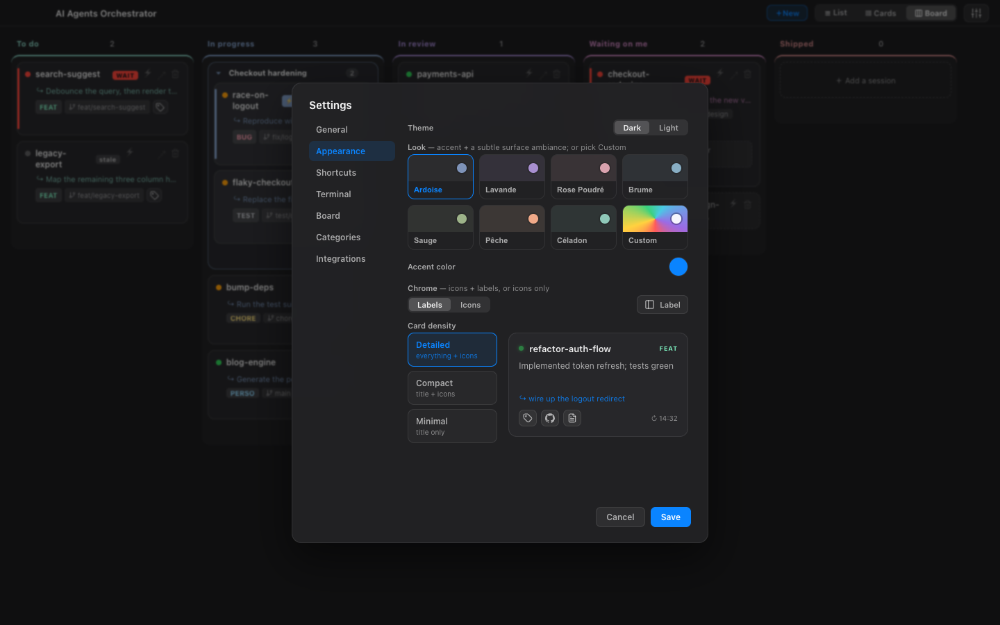
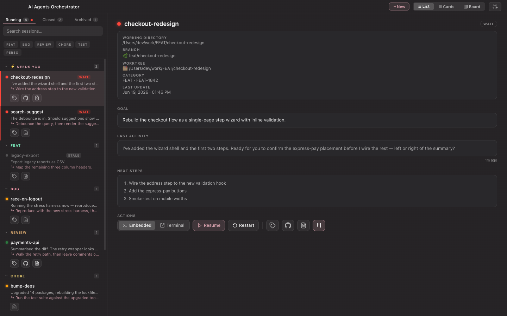
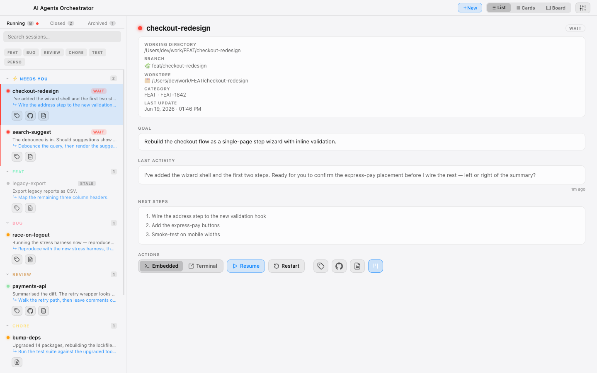
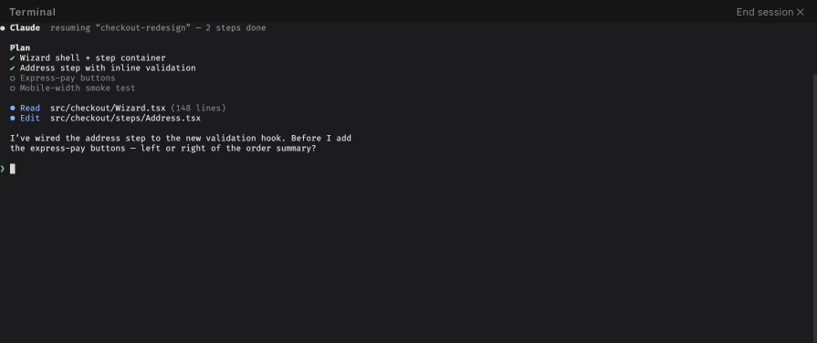
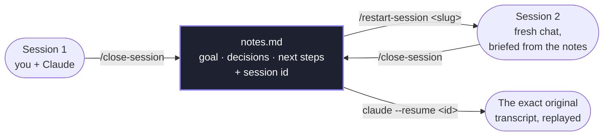

<div align="center">

<a href="https://t-mercier.github.io/ai-agents-orchestrator/"></a>

# AI Agents Orchestrator

**Mission control for your AI development sessions — a tiny native macOS dashboard that brings order to the chaos.**

[](https://t-mercier.github.io/ai-agents-orchestrator/)

[](CHANGELOG.md)
[](https://github.com/t-mercier/ai-agents-orchestrator/actions)
[](LICENSE)
[](https://www.apple.com/macos/)
[](https://claude.com/claude-code)

</div>


> AI coding sessions don't last minutes anymore. They last **days, weeks, sometimes entire projects** — each accumulating context, decisions, repositories, tasks and agents. Before long, you're juggling dozens of parallel workstreams.
>
> **AI Agents Orchestrator gives you a unified view of every session, across every project** — so you can stay focused instead of getting lost in the chaos.

## Contents

[What's new](#whats-new) · [The problem](#the-problem) · [Features](#features) · [How it works](#how-it-works) · [Quick start](#quick-start) · [Session skills](#session-skills) · [Customization](#customization) · [FAQ](#faq) · [Security](#security) · [Tech stack](#tech-stack) · [Roadmap](#roadmap) · [Changelog](#changelog) · [Contributing](#contributing) · [License](#license)


> [!NOTE]
> ## What's new
> Newest first — full history in the [changelog](CHANGELOG.md).
>
> - 🔌 **Import, upgraded** — adopt a session into a chosen **space** (not just Work/Personal), **paste a session ID** to grab one that isn't in the recent list, and open it in the **embedded** terminal or an external one — full parity with ＋New.
> - ⌨️ **Start a new session in the embedded terminal** — ＋New gets the same **Embedded / Terminal** toggle as Resume/Restart, so a brand-new session can open in the built-in terminal instead of an external tab. New sessions launch in *auto* mode so they're ready to work.
> - 🗂 **Spaces** — group categories under named spaces (*Work*, *Perso*, a client). List & Cards fold into collapsible **space sections**; the Board filters by space.
> - ⚲ **Filter popover** — the category chip row became a single **⚲ Filter** button + checkbox menu (Spaces + Categories, one control across every view).
> - 🧩 **Session skills renamed** to the `*-session` form (`/start-session`, `/close-session`…) — re-run `bash scripts/install.sh --force`.
> - 📄 **Source-available licence** — free to use (incl. at work), no resale.

## The problem

Today each session is a buried terminal tab. Which are running? Which are **waiting for you**? Which finished an hour ago? Where did you leave each one?

Terminal tabs don't scale. You need mission control.

## Features

- **Live dashboard** — polled every 5s. Every session's status at a glance: **busy** · **idle** · **waiting** (pulsing) · **stale** (terminal gone, work not wrapped up) · **background shell**.
- **Three views** — a grouped **List**, a full-width **Cards** grid, and a **Board** (kanban).
- **Kanban board** — drag to reorder (insertion line), **drop a card onto another to group** them (named, collapsible), **attach notes** to a card or group, flag **urgent**, and add sessions from the board itself. Generative **column colours** (pick one seed → a harmonious set across however many columns you have), with each column tinting its own accent.
- **In-context detail** — click any card to open a **slide-over** with the session's goal, last activity, branch, Jira / PR links, and one-click **Resume / Restart / terminal** — without leaving the view.
- **Start & resume your way** — open a **new** session or pick an existing one back up in the **built-in terminal** (in the app, xterm.js + portable-pty) *or* in **your own terminal** (iTerm / Terminal) — your choice, one toggle. Detach the built-in one into its own always-on-top window if you like.
- **Keyboard-first** — arrows / `j` `k` to navigate, `Enter` to launch, `/` to search, `1`–`3` for tabs, `←/→` to switch tabs, `v` for view, `b` for board. **Remap any of it** in Settings → Shortcuts.
- **Looks & density** — curated colour "looks" (accent + a subtle surface ambiance), a custom accent, and Detailed / Compact / Minimal card density. Dark & light themes.
- **Lifecycle tabs** — Running · Closed · Archived, with live **search** and a **⚲ Filter** popover (category checkboxes, one control across every view).
- **Spaces** — group categories under multiple named spaces (e.g. *Work*, *Perso*, a client). **List & Cards** organise into collapsible **space sections** → category groups; the **Board** gets its own space filter next to its search; pinned / ⚡ waiting cards keep a small space tag. A single space configured ⇒ no space chrome at all.
- **Backup** — export / import all your settings to a file (handy before a reinstall).

### Three ways to look at your work

| Cards | Board |
|:---:|:---:|
|  |  |
| Full-width grid — every session at a glance. | Kanban with groups, attached notes, urgent flags, and generative column colours. |

Click any session for a **detail slide-over** — goal, branch, links, and one-click Resume / Restart — without leaving the grid:



Make it yours — curated colour "looks" (accent + a subtle surface ambiance), a custom accent, density, dark **and** light themes:

| Appearance settings | A colour "look" — Rose Poudré |
|:---:|:---:|
|  |  |

…and the same dashboard in the light theme:



### Resume right in the app



Every session resumes in an **embedded terminal** (xterm.js + a Rust pty) — pick the exact conversation back up where you left it, or pop it into its own always-on-top window.

## How it works

**Local-first. Zero network.**

AI Agents Orchestrator is a *projection* of the session state Claude Code already writes under `~/.claude` (session metadata, `notes.md`, JSONL transcripts). It **never** touches the network and **never** stores secrets — it visualizes what's on disk and lets Claude Code do the rest.

It is **read-only on `~/.claude` by design**. The only writes it makes are two explicit actions you trigger — **archiving** a session and **saving a PR link** — written atomically and confined to a `notes.md` under your configured roots (see [`docs/adr`](docs/adr)). Your UI preferences live in `localStorage` + your own config file.

## Quick start

**Requirements:** macOS 13+ · [Rust](https://rustup.rs) + the Tauri CLI (`cargo install tauri-cli`) · Xcode Command Line Tools (`xcode-select --install`) · [Claude Code](https://claude.com/claude-code).

```bash
git clone https://github.com/t-mercier/ai-agents-orchestrator.git
cd ai-agents-orchestrator

# 1. Install the session skills + seed your config
bash scripts/install.sh

# 2. Run the app (system WebView — no Chromium bundled)
cargo tauri dev
```

The dashboard auto-discovers your sessions from `~/.claude`.

**Build a `.app` / `.dmg`:**

```bash
cargo tauri build      # bundle in src-tauri/target/release/bundle/
```

> [!NOTE]
> Built unsigned for now — on first launch, right-click the app → **Open** to get past Gatekeeper. Signed/notarized releases come once it's out of alpha.

## Session skills

The launcher buttons (**＋ New**, **Resume**, **Restart**, **Archive**) drive a small set of Claude Code skills. `scripts/install.sh` copies them into `~/.claude/skills/`:

| Skill | What it does |
|---|---|
| `/start-session <CAT> <ticket> <name>` | Create a session workspace + `notes.md` under the category's folder, register it, sync the repo |
| `/close-session` | Wrap up the session: summarise into `notes.md` + append a history entry tagged with the session id |
| `/restart-session <slug>` | Reload a session's notes **and its recorded session id** into a fresh session (history stays linked) |
| `/archive-session <slug>` | Mark a session archived (drops it from the active list) |
| `/rename-category <OLD> <NEW>` | Rename a category everywhere — moves the folder, re-tags notes, updates config |

Categories, note locations and Obsidian vaults all come from your shared config, so the skills and the app stay in sync. The installer won't overwrite a customised skill unless you pass `--force`.

> [!IMPORTANT]
> **Updating from an earlier version?** This release makes the skills **root-aware** (they resolve a session's folder from its category's root, with the old work/personal layout still supported) and **fixes `/restart-session`** — its un-archive step used to over-match and could strip valid `notes.md` history lines. **Re-run the installer to pull the updated skills:**
> ```bash
> bash scripts/install.sh --force
> ```

### Memory that beats compaction

Long sessions force the assistant to **compact** its own history — silently dropping older context until it loses the thread. This app keeps what matters in `notes.md` on disk instead: `/close-session` records the goal, decisions and next steps **plus the session id**; `/restart-session` loads all of it — and that id — into a fresh conversation, so the chain back to the original is never broken. Need the literal transcript? `claude --resume <id>` replays it verbatim.



Everything stays linked — **notes → session id → transcript** — so nothing important lives only in a context window.

📖 **New to the lifecycle?** The **[Guide](docs/GUIDE.md)** explains the four session states (Active · Stale · Closed · Archived), Start vs Resume vs Restart, and how the notes beat compaction — in plain terms, no jargon.

## Customization

Edit everything in the app's **Settings (⚙)** — categories & colours, scan roots, terminal app, themes/looks, density, keyboard shortcuts. It all persists to `~/.config/ai-agents-orchestrator/config.json` (which the skills read too):

```json
{
  "roots": [
    { "name": "Work",  "path": "~/work" },
    { "name": "Perso", "path": "~" }
  ],
  "categories": [
    { "name": "FEAT",   "color": "#7df0c0", "root": "Work" },
    { "name": "BUG",    "color": "#ff9eb1", "root": "Work" },
    { "name": "REVIEW", "color": "#d9a86e", "root": "Work" },
    { "name": "PERSO",  "color": "#8fd9ff", "root": "Perso" }
  ],
  "obsidian": { "enabled": false, "workVaultPath": "", "personalVaultPath": "" },
  "ticketBaseUrl": ""
}
```

Each category names the **space** it lives under — the `root` key in the config (its folder is `<space path>/<CATEGORY>`), so the *same* category name can exist in several spaces, and the titlebar space selector scopes the view. *(Back-compat: the legacy `workRoot`/`personalRoot` + a category `scope` of `work`/`personal` are still read and auto-migrated to `Work`/`Perso` spaces, so existing configs keep working untouched.)*

**Ticket tracking — any tracker, not just Jira.** `ticketBaseUrl` is just a URL prefix: the app appends each session's ticket ID to it to make the ID clickable. Point it at whatever you use:

| Tracker | `ticketBaseUrl` |
|---|---|
| Jira | `https://yourcompany.atlassian.net/browse/` |
| Linear | `https://linear.app/your-team/issue/` |
| GitHub Issues | `https://github.com/owner/repo/issues/` |
| Azure DevOps | `https://dev.azure.com/org/project/_workitems/edit/` |

Leave it blank and ticket IDs simply show as a (non-clickable) tag. *(The legacy key `jiraBaseUrl` is still read for backward compatibility.)*

## FAQ

**Does it show all my sessions, or only ones started with `/start-session`?** Two sources, both automatic:

- **Running** — *every live Claude Code session* on your machine shows up, managed or not. Unmanaged ones just carry less metadata (no goal/category/ticket) until you `/start-session` or `/restart-session` them.
- **Closed / Archived / Stale** — these list **managed** sessions: ones with a `notes.md` under your category roots (created by `/start-session`). That `notes.md` is what gives the dashboard the goal, history, and lifecycle state.

**Can I import my existing / older Claude sessions?** Live ones need nothing — they're already in **Running**. Past sessions that were never `/start-session`-ed have no `notes.md`, so they don't show in the historical tabs. To bring one under management, run `/restart-session <slug>` (or `/start-session`) for that work — it creates the `notes.md` and registers it. Setting your category **root dir** only tells the app *where* to scan for managed sessions; it doesn't ingest arbitrary `~/.claude` transcripts on its own.

> [!TIP]
> Auto-importing *any* past session (not just managed ones) isn't built yet — it's a great idea on the roadmap. Open an issue if you want it.

## Security

- **No shell-string execution** — `open`, `osascript`, `git`, `claude` are all spawned with separate args (no injection); AppleScript uses the `on run argv` pattern.
- Repo / branch / URL inputs are **allowlist-validated** (absolute path, real git repo, safe branch, `github.com/owner/repo/pull/N`).
- The two filesystem writes (archive, PR link) are **atomic**, target a real `notes.md`, and are **confined under your configured roots** (canonicalized — no `../` escape).
- External links open in your **system browser**, never inside the app.
- Nothing is sent over the network; no secrets stored.

## Tech stack

| Layer | Tool |
|---|---|
| Desktop | **Tauri v2** (Rust + the OS's WebView — ~8 MB app, no Chromium) |
| UI | Vanilla JS — no framework (fast, simple, hackable) |
| Terminal | xterm.js + portable-pty |
| Backend | Rust (`config` · `reader` · `pty` · commands) |
| Tests | Rust unit tests (47, `cargo test`) + Jest (56, renderer logic) |

## Roadmap

- [x] In-app Settings UI (categories, colours, roots, themes, shortcuts)
- [x] Bundled session skills + one-command installer
- [x] Kanban board (groups, attached notes, generative colours)
- [x] Export / import settings
- [x] Tracker-agnostic ticket links (Jira, Linear, GitHub Issues, Azure DevOps)
- [ ] **Beyond Claude Code** — GitHub Copilot, and other agent CLIs next (today it reads Claude Code's session state)
- [ ] Standalone terminal tab — use the in-app terminal for ad-hoc commands, not just resuming a session
- [ ] Signed + notarized `.dmg` releases
- [ ] Homebrew cask · auto-update
- [ ] Optional Obsidian integration (auto-distil notes)

## Changelog

See [`CHANGELOG.md`](CHANGELOG.md) for notable changes ([Keep a Changelog](https://keepachangelog.com/) format).

## Contributing

**Issues and suggestions are very welcome** — bug reports, feature ideas, rough edges. This is an opinionated, design-led project that I maintain solo, so I'm not taking outside code contributions for now (it keeps the UX coherent and the codebase cleanly mine). Open an issue and let's talk. See [`CONTRIBUTING.md`](CONTRIBUTING.md).

## License

**[AI Agents Orchestrator Source Available License v1.0](LICENSE)** — free to download, use, and evaluate, including in the course of your professional work at a company. You **may not** resell it, redistribute it, deploy it organization-wide, offer it as a hosted/SaaS service, rebrand it, or distribute modified versions, without written permission. Source is available for transparency, learning, and contribution. Want to do more? Reach out.

Built by an ADHD developer who loves parallel-tasking with Claude a little too much — for anyone juggling more parallel work than one brain can hold.
