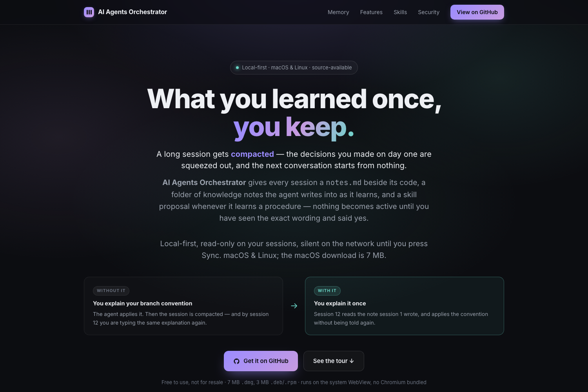
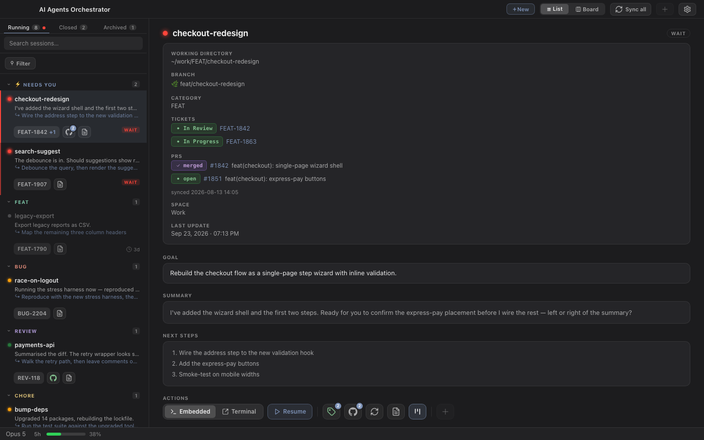
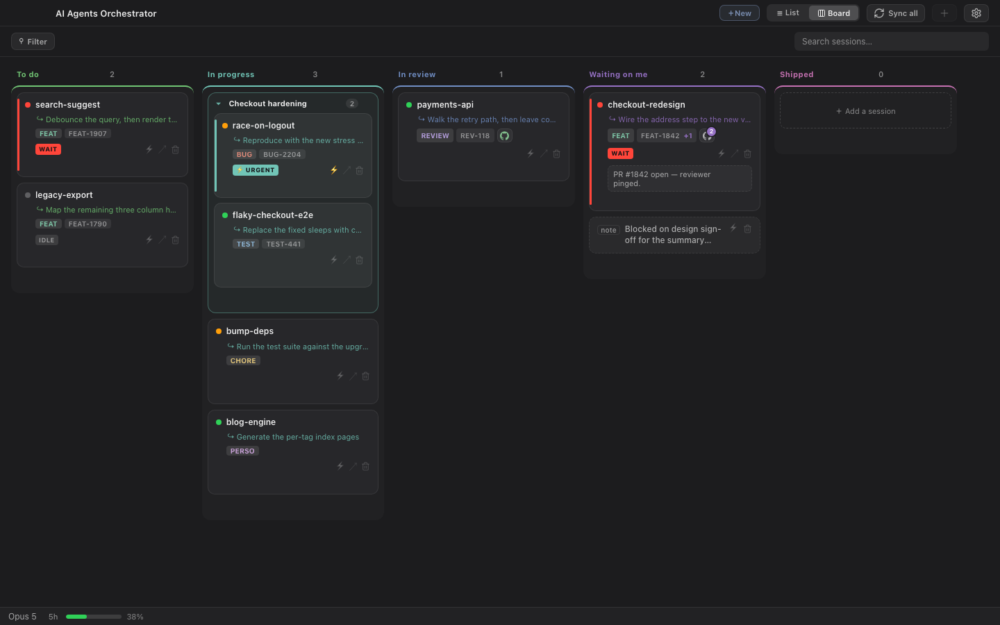
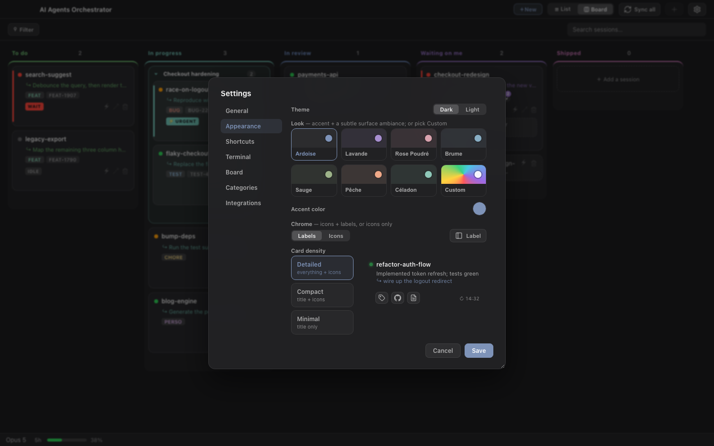
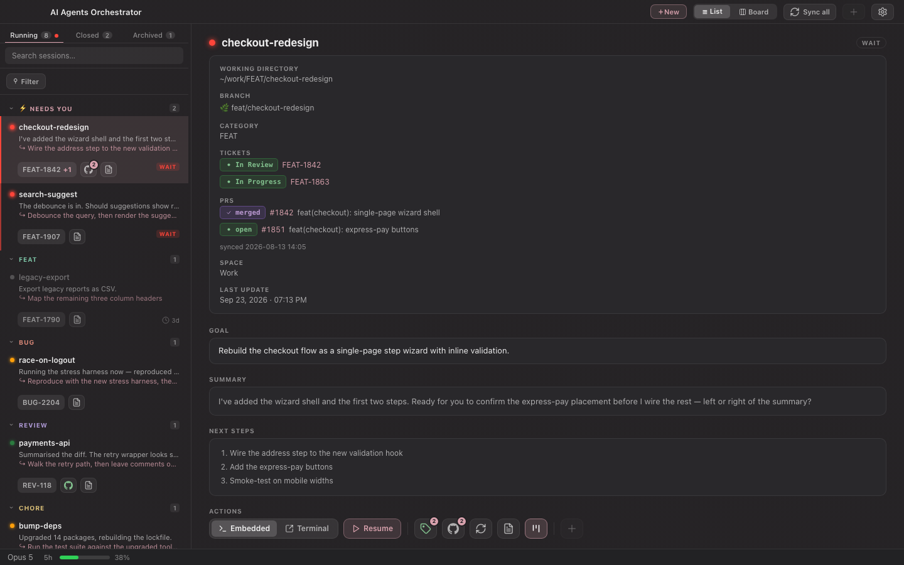
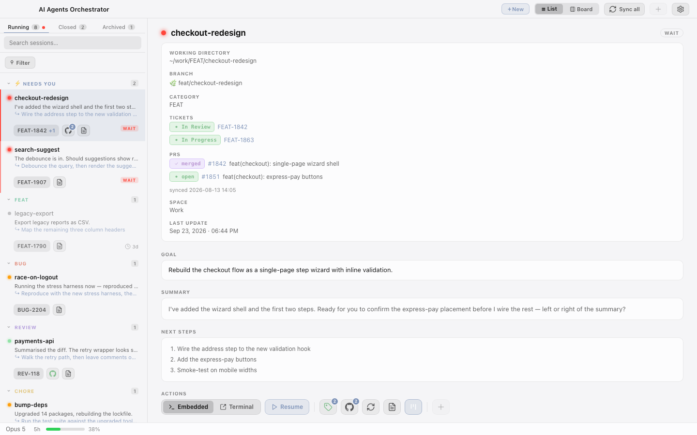
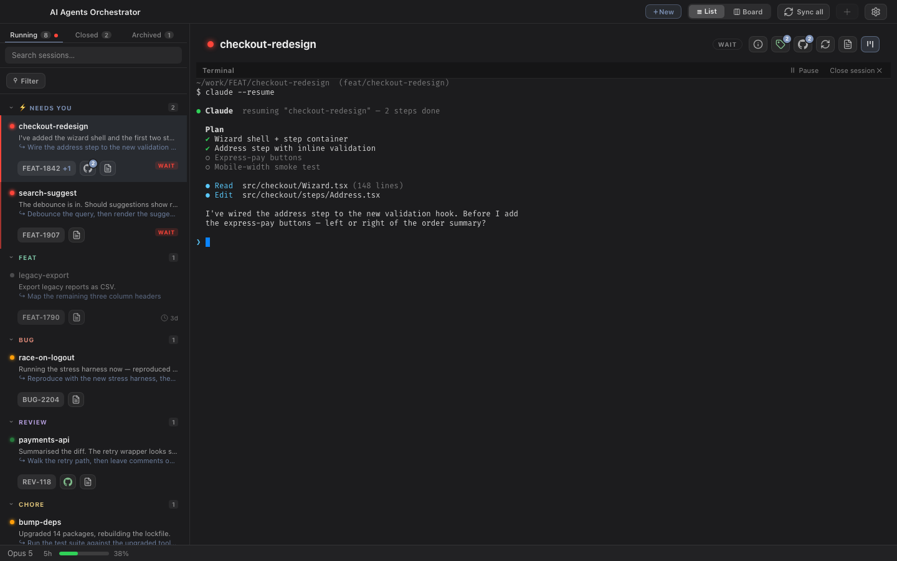
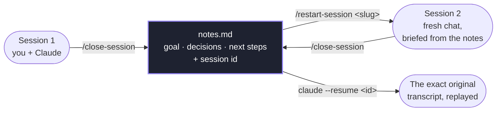

<div align="center">

<a href="https://t-mercier.github.io/ai-agents-orchestrator/"></a>

# AI Agents Orchestrator

**What you learned once, you keep — a tiny native dashboard for macOS & Linux.**

[](https://t-mercier.github.io/ai-agents-orchestrator/)

[](CHANGELOG.md)
[](https://github.com/t-mercier/ai-agents-orchestrator/actions)
[](LICENSE)
[](https://www.apple.com/macos/)
[](https://www.kernel.org/)
[](https://claude.com/claude-code)

</div>


> A long session gets **compacted** — the decisions you made on day one are squeezed out, and the next conversation starts from nothing. Run several in parallel and you also lose track of which one is waiting on you.
>
> **AI Agents Orchestrator gives every session a memory it keeps** — a `notes.md` beside its code, a folder of knowledge notes the agent writes into as it learns, and a skill proposal whenever it learns a procedure. Nothing becomes active until you have seen the exact wording and said yes. And every session in one window: live status, the work in progress, and a terminal for each. Local-first, read-only on your session data, and silent on the network until you press **Sync**.

## TL;DR — how you're meant to use it

**Run your sessions inside the app.** Each one gets its own embedded terminal, so switching
between a dozen of them is a click instead of a hunt through terminal windows — that's the
whole point. Opening in your own terminal is supported, but it puts the juggling back.

**The lifecycle, in one line:**

```
＋ New  →  Running  →  (terminal gone → still Running, "stale")  →  Closed  →  Archived
```

Nothing moves on its own — you close, you archive.

| Action | What it does |
|---|---|
| **＋ New** | Creates the workspace + its `notes.md`, registers the session, launches it. **Start here** — you never need the terminal first. |
| **Resume** | Relaunches a session the app already manages. |
| **Adopt** | For a session you started outside the app (listed under *Recent · unmanaged*): relaunches it **and** creates its `notes.md` + registers it. One-time; after that it's just Resume. |
| **Close session ✕** | Wraps it up with a summary → Closed. From a stale session, the **Close** button does the same headlessly, no terminal needed. |

Two things that save pain: a session's **`notes.md` is its memory** (it survives compaction —
`/save-session` checkpoints it, `/close-session` wraps it up), and **one session = one process**
(resuming one that's already running forks the conversation, so take *Reveal window* when the
app warns you).

Full tour: **[the guide](docs/GUIDE.md)**.

## Contents

[TL;DR](#tldr--how-youre-meant-to-use-it) · [What's new](#whats-new) · [The problem](#the-problem) · [Features](#features) · [How it works](#how-it-works) · [Quick start](#quick-start) · [Session skills](#session-skills) · [Customization](#customization) · [FAQ](#faq) · [Security](#security) · [Tech stack](#tech-stack) · [Roadmap](#roadmap) · [Changelog](#changelog) · [Contributing](#contributing) · [License](#license)


> [!NOTE]
> ## What's new
>
> - ⟳ **Sync realigns a session with reality** — one button: ticket statuses read from your tracker, and any pull request opened since the last checkpoint attached. Nothing runs in the background.
> - 🔀 **Pull requests carry their state** — open, merged, closed or draft, on the card and spelled out with each PR's title in the detail panel.
> - 🏷 **Tickets carry their tracker's own status word** — `In Review`, `Triaged`, whatever your project calls it. Read through MCP, so the app itself never holds a tracker credential.
> - ✅ **Close finishes a stale session properly** — it resumes the session headless, writes the summary, attaches the PRs, and moves it to Closed. No terminal opens.
> - 🧠 **Knowledge notes build themselves** — `/learn` writes the moment something durable comes up, extending the note that already owns the subject; an opt-in hook now catches it the instant your own wording states a preference or correction, not only when you ask.
> - 🩺 **Doctor finds what is genuinely broken** — a session filed as closed while its process is still running, a frontmatter pointing at a conversation that no longer exists, a pidfile for a process that has exited. It reports; you tick what it repairs. A pruned transcript is ordinary ageing, and it says so rather than counting it as damage.
> - 🧹 **Clean audits the rest by age** — it proposes what to archive and what to delete, using the same last-touched date the list already shows. Nothing is pre-ticked, and a deletion goes to the Trash.
> - 🛡 **The app's skills keep themselves current** — the lifecycle skills are app-owned, synced silently at launch like any app resource. An older build never reverts a newer install, and anything you'd edited by hand is copied to `.archive/` before being replaced — named in a notice, never silently lost.
>
> Earlier releases: the [changelog](CHANGELOG.md) has the full history.

## The problem

Today each session is a buried terminal tab. Which are running? Which are **waiting for you**? Which finished an hour ago? Where did you leave each one?

Terminal tabs don't scale. You need mission control.

## Features

- **Live dashboard** — polled every 5s. Every session's status at a glance: **busy** · **idle** · **waiting** (pulsing) · **stale** (terminal gone, work not wrapped up) · **background shell**.
- **Two views** — a grouped **List** and a **Board** (kanban).
- **Kanban board** — drag to reorder (insertion line), **drop a card onto another to group** them (named, collapsible), **attach notes** to a card or group, flag **urgent**, and add sessions from the board itself. Generative **column colours** (pick one seed → a harmonious set across however many columns you have), with each column tinting its own accent.
- **In-context detail** — click any card to open a **slide-over** with the session's goal, last activity, branch, Jira / PR links, and one-click **Resume / Restart / terminal** — without leaving the view.
- **Tickets & PRs on the card** — the ticket id and a GitHub icon sit on every card, clickable straight through to your tracker. A session can carry **several** of each (a task split across two PRs, an epic plus its sub-task): the icon then shows a count and opens a picker. Editable from the app, and `/save-session` · `/close-session` keep the lists filled as the work grows.
- **Start & resume your way** — open a **new** session or pick an existing one back up in the **built-in terminal** (in the app, xterm.js + portable-pty) *or* in **your own terminal** (iTerm / Terminal) — your choice, one toggle. Detach the built-in one into its own always-on-top window if you like.
- **Keyboard-first** — arrows / `j` `k` to navigate, `Enter` to launch, `/` to search, `1`–`3` for tabs, `←/→` to switch tabs, `v` to toggle list ⇄ board, `b` for board. **Remap any of it** in Settings → Shortcuts.
- **Looks & density** — curated colour "looks" (accent + a subtle surface ambiance), a custom accent, and Detailed / Compact / Minimal card density. Dark & light themes.
- **Lifecycle tabs** — Running · Closed · Archived, with live **search** and a **⚲ Filter** popover (category checkboxes, one control across every view).
- **Spaces** — group categories under multiple named spaces (e.g. *Work*, *Perso*, a client). The **List** organises into collapsible **space sections** → category groups; the **Board** gets its own space filter next to its search. Pinned and ⚡ waiting cards float above every space section — they're your shortlist, so they stay at the top of the column. A single space configured ⇒ no space chrome at all.
- **Knowledge that outlives a session** — closing a session distils its high-signal decisions into a folder of **knowledge notes** (per space), so what cost you an afternoon is still there months later — and `/route <ticket>` reads it back, with your past sessions and your tracker, *before* you open the code. A folder you choose; **Obsidian is one way to browse it, not a requirement**.
- **Backup** — export / import all your settings to a file (handy before a reinstall).

### Two ways to look at your work

| List | Board |
|:---:|:---:|
|  |  |
| Grouped by space → category, with the detail inline beside it. | Kanban with groups, attached notes, urgent flags, and generative column colours. |

On the Board, click any card for a **detail slide-over** — goal, branch, links, and one-click Resume / Restart — without leaving the board.

Make it yours — curated colour "looks" (accent + a subtle surface ambiance), a custom accent, density, dark **and** light themes:

| Appearance settings | A colour "look" — Rose Poudré |
|:---:|:---:|
|  |  |

…and the same dashboard in the light theme:



### Resume right in the app



Every session resumes in an **embedded terminal** (xterm.js + a Rust pty) — pick the exact conversation back up where you left it, or pop it into its own always-on-top window.

## How it works

**Local-first. Zero network.**

AI Agents Orchestrator is a *projection* of the session state Claude Code already writes under `~/.claude` (session metadata, `notes.md`, JSONL transcripts). It reaches the network **only** when you press **Sync** — that button is the opt-in, and nothing else in the app calls out — and it **never** stores secrets: it visualizes what's on disk and lets Claude Code do the rest.

It is **read-only on your session data by design**. The only writes it makes to session files are explicit actions you trigger — **archiving** a session and **saving its PR links / tickets** — written atomically and confined to a `notes.md` under your configured roots (see [`docs/adr`](docs/adr)). Separately, you can ask it to **install the session skills** into `~/.claude/skills/` (a Settings button / first-launch prompt) — a user-triggered write confined to that skills folder, never touching your transcripts. Your UI preferences live in `localStorage` + your own config file.

## Quick start

### Download a build

Grab the newest asset from **[Releases](https://github.com/t-mercier/ai-agents-orchestrator/releases)** —
universal `.dmg` (Intel & Apple Silicon) · `.deb` · `.AppImage` · `.rpm`. Nothing to compile, and no
Chromium: it runs on the system WebView, so the `.dmg` is 7 MB and the `.deb`/`.rpm` about 3 MB. The `.AppImage` is the exception at ~77 MB — the format bundles its own runtime.

You also need **[Claude Code](https://claude.com/claude-code)** — the app is a view onto the sessions it
writes to `~/.claude`, so it has nothing to show without it. On first launch the app installs its own
session skills into `~/.claude/skills/` and keeps them current from then on; see
[Session skills](#session-skills).

> [!NOTE]
> **macOS:** the builds are unsigned for now, so Gatekeeper calls the app "damaged" (it isn't). Move it to
> `/Applications`, then strip the quarantine flag once — right-click → **Open** no longer clears this on
> recent macOS:
> ```bash
> xattr -cr "/Applications/AI Agents Orchestrator.app"
> ```
> Signed and notarized releases come once it is out of alpha.

### Build from source

Only needed to contribute, or to run an unreleased branch.

**Requirements:** [Rust](https://rustup.rs) + the Tauri CLI (`cargo install tauri-cli`) · [Claude Code](https://claude.com/claude-code), plus your platform's WebView toolchain:

- **macOS 13+** — Xcode Command Line Tools (`xcode-select --install`).
- **Linux** — WebKitGTK + GTK dev libraries. On Debian/Ubuntu:
  ```bash
  sudo apt install libwebkit2gtk-4.1-dev libsoup-3.0-dev build-essential \
    curl wget file libxdo-dev libssl-dev libayatana-appindicator3-dev librsvg2-dev pkg-config
  ```

```bash
git clone https://github.com/t-mercier/ai-agents-orchestrator.git
cd ai-agents-orchestrator

# 1. Install the session skills + seed your config
bash scripts/install.sh
#    (later, after a `git pull`, re-run it with --force — see "Session skills")

# 2. Run the app (system WebView — no Chromium bundled)
cargo tauri dev
```

The dashboard auto-discovers your sessions from `~/.claude`.

**Build an installable bundle:**

```bash
cargo tauri build      # macOS: .app/.dmg · Linux: .deb/.AppImage — in src-tauri/target/release/bundle/
```

> [!NOTE]
> **macOS:** a bundle you build yourself is unsigned too — clear the quarantine flag the same way as a
> downloaded build (see [Download a build](#download-a-build)).

> [!NOTE]
> **Linux:** runs on X11 and Wayland (verified on GNOME/Wayland). One feature is macOS-only: *revealing* an existing external terminal window (there's no portable way to focus a window by tty on X11/Wayland), so that button is hidden on Linux. Opening a new terminal and the in-app embedded terminal both work.

## Session skills

The launcher buttons (**＋ New**, **Resume**, **Restart**, **Archive**) drive a small set of Claude Code skills. `scripts/install.sh` copies them into `~/.claude/skills/`:

| Skill | What it does |
|---|---|
| `/start-session <CAT> <ticket> <name>` | Create a session workspace + `notes.md` under the category's folder, register it, sync the repo |
| `/close-session` | Wrap up the session: summarise into `notes.md` + append a history entry tagged with the session id |
| `/save-session` | Checkpoint mid-flight (same summary as close, marked `(in progress)`) **without** closing it — handy before a context compaction |
| `/sync-refs <notes>` | Realign one session's references: each ticket's current status from the tracker (via MCP) and any pull request whose branch names one of its tickets. Run by the dashboard's **Sync** |
| `/wrap-session <notes> <id>` | The headless twin of `/close-session`, run by the dashboard's **Close** button: steps 1–6 only, no distil and no questions — `--print` has no one to answer them |
| `/restart-session <slug>` | Reload a session's notes **and its recorded session id** into a fresh session (history stays linked) |
| `/archive-session <slug>` | Mark a session archived (drops it from the active list) |
| `/import-session <CAT> <name>` | Adopt an unmanaged Claude Code session into management, under a chosen space and category |
| `/rename-category <OLD> <NEW>` | Rename a category everywhere — moves the folder, re-tags notes, updates config |
| `/skill-propose` | Turn what this session taught into a new skill, or a patch to an existing one. With you there on a repeated correction it shows the verbatim change and applies it on your yes, logging it to `~/.claude/skills-applied.log`; otherwise it stages it for `/skills-review` |
| `/skills-review` | The approval gate for staged proposals: list, diff, then approve or reject. Where a proposal lands when nobody was there to answer it |
| `/skills-curate` | Periodic pass over the whole set: refresh usage, report `active`/`stale`/`archived`, stage merges of overlapping skills |
| `/learn` | Write one atomic note into this space's knowledge notes **the moment** something durable is learned — not at session close |
| `/route <ticket \| topic>` | A **Context Brief before you investigate**: this space's knowledge notes + past session notes + your tracker, summarised. Read-only |

Categories, note locations and knowledge-notes folders all come from your shared config, so the skills and the app stay in sync.

### Optional: attach PRs automatically

A session's pull requests are read from its `notes.md`, which only the skills above write — so a PR opened mid-session stays invisible until your next `/save-session`. The bundled `hooks/pr_attach.py` closes that gap: it attaches the URL the moment `gh pr create` prints it.

```bash
bash scripts/install.sh --with-hooks
```

That copies the script and prints the one-line entry to paste into the `PostToolUse` → `Bash` hooks of `~/.claude/settings.json`. Wiring is left to you on purpose — that file decides which code Claude Code runs on your machine, and nothing here edits it for you. The hook only ever *adds* a link, never replaces or removes one.

### Optional: a nudge toward `/learn`

`/learn` and `/skill-propose` both say "use PROACTIVELY" in their own description, but that framing only helps if the model happens to re-read it at the right moment — nothing forces the check at the exact turn a correction lands, so the knowledge base ends up depending on you asking for it. The bundled `hooks/learn_nudge.py` closes that gap on the input side: on `UserPromptSubmit`, it checks your message against a short, high-precision phrase list ("always", "never", "from now on", "je préfère", "ne ... plus"...) and, when one matches, injects a one-line reminder for the model to check `/learn`'s or `/skill-propose`'s own criteria — silently, so a message that doesn't actually qualify produces no visible output at all. Throttled to once per session per 15 minutes.

Same install path — it's the second script `--with-hooks` copies and prints a settings.json entry for, this time under `UserPromptSubmit`.

This only catches signal carried in your own wording. A fact or gotcha you never phrase as a standing preference still relies on the model's own judgment, or on `/save-session`/`/close-session`'s distil step — the hook narrows the gap, it doesn't close it.

> [!IMPORTANT]
> **Working from a clone? `git pull` does not update your skills.** It updates the repo's `skills/`; the copies Claude Code actually loads live in `~/.claude/skills/`. And a plain install **keeps an existing skill untouched** — new skills arrive, but *changed* ones are skipped, so a shipped fix silently never reaches you. After any pull that touches skills:
>
> ```bash
> git pull && bash scripts/install.sh --force
> ```
>
> `--force` is not the default because it overwrites a skill you may have customised — so the installer names the ones whose updates it withheld, and you decide. Note `npm run install:skills` does **not** force. The app itself needs no button for this: it syncs its own skills silently at launch — an app built before your last `install.sh --force` run stands down rather than revert it, and a skill you'd edited by hand is copied to `~/.claude/skills/.archive/` before being replaced, named in a notice. **Settings → Session skills → Sync skills to this version** forces this build's versions on demand, under the same never-silently-lose rule.
>
> **Updating from an earlier version?** Your config **auto-migrates to v2** on first launch — named spaces + per-space knowledge-notes folders, with a `.v1-backup` kept (see [ADR-015](docs/adr/ADR-015-config-v1-to-v2-migration-flag-gated-self-cleaning.md)). Nothing to do by hand.

### Memory that beats compaction

Long sessions force the assistant to **compact** its own history — silently dropping older context until it loses the thread. This app keeps what matters in `notes.md` on disk instead: `/close-session` records the goal, decisions and next steps **plus the session id**; `/restart-session` loads all of it — and that id — into a fresh conversation, so the chain back to the original is never broken. Need the literal transcript? `claude --resume <id>` replays it verbatim.

**And a second tier, across sessions.** A `notes.md` remembers *one* session; the decision that cost you an afternoon deserves to outlive it. Give a space a knowledge-notes folder and two things fill it: `/close-session` distils the session's high-signal decisions on the way out, and **`/learn` writes a note the moment something durable comes up** — which matters, because a session you never close teaches the next one nothing. `/learn` extends an existing note rather than adding a near-duplicate, and announces every write in one line; there is deliberately no approval prompt, since a prompt at every insight would defeat writing in flight.

The skill ships, but the *trigger* has to be in front of the assistant at all times to fire on its own — so add this to your `~/.claude/CLAUDE.md`:

> When something durable emerges mid-session — a preference or correction I stated, a stable fact about the environment, a gotcha with its workaround — invoke `/learn` then, not at the end. The test is: does writing this stop me repeating myself?
 `/route <ticket | topic>` then reads that folder, your past session notes and — when a tracker is reachable — its tickets, to build a **Context Brief before you open the code**. It resolves *which* folder from the current session's space, so work and personal knowledge never bleed into each other.


```mermaid
flowchart LR
    S1(["Session 1<br/>you + Claude"]) -->|/close-session| N["notes.md<br/>goal · decisions · next steps<br/>+ session id"]
    N -->|"/restart-session &lt;slug&gt;"| S2(["Session 2<br/>fresh chat,<br/>briefed from the notes"])
    N -->|"claude --resume &lt;id&gt;"| R(["The exact original<br/>transcript, replayed"])
    S2 -->|/close-session| N
    classDef disk fill:#1e2230,stroke:#9b8cff,stroke-width:2px,color:#fff;
    class N disk;
```

Everything stays linked — **notes → session id → transcript** — so nothing important lives only in a context window.

<details>
<summary><strong>Optional: get nudged to <code>/save-session</code> before compaction</strong></summary>

A checkpoint only helps if you remember to run it. This **opt-in** Claude Code hook watches
the transcript size and reminds you to `/save-session` as context fills (≈50% / 75% / 90%).
It's not installed for you — the app never edits your global `~/.claude/settings.json`.
Add it there yourself under `hooks`:

```json
{
  "hooks": {
    "Stop": [{ "hooks": [{ "type": "command", "command": "SESSION_ID=$(jq -r '.session_id // empty' 2>/dev/null); [ -z \"$SESSION_ID\" ] && exit 0; T=$(find \"$HOME/.claude/projects\" -maxdepth 2 -name \"${SESSION_ID}.jsonl\" 2>/dev/null | head -1); [ -f \"$T\" ] || exit 0; S=$(wc -c < \"$T\"); if [ \"$S\" -gt 10000000 ] && [ ! -f \"/tmp/cc-90-$SESSION_ID\" ]; then touch /tmp/cc-50-$SESSION_ID /tmp/cc-75-$SESSION_ID /tmp/cc-90-$SESSION_ID; echo '{\"systemMessage\":\"Context ~90% - compact imminent. Run /save-session now.\"}'; elif [ \"$S\" -gt 6000000 ] && [ ! -f \"/tmp/cc-75-$SESSION_ID\" ]; then touch /tmp/cc-50-$SESSION_ID /tmp/cc-75-$SESSION_ID; echo '{\"systemMessage\":\"Context ~75% used. Run /save-session.\"}'; elif [ \"$S\" -gt 3000000 ] && [ ! -f \"/tmp/cc-50-$SESSION_ID\" ]; then touch /tmp/cc-50-$SESSION_ID; echo '{\"systemMessage\":\"Context ~50% used - consider /save-session.\"}'; fi" }] }]
  }
}
```

The `/tmp` flags make each threshold fire once per session. Pair it with a `PreCompact`
hook if you want a last-ditch save right before Claude Code compacts.

</details>

<details>
<summary><strong>Usage bar (model · 5h / weekly limits · context) — automatic</strong></summary>

A slim bottom bar shows your **model**, the **5-hour** and **weekly** rate-limit windows
(colour-coded, with reset countdowns), and the current **context %** — the numbers a Claude
Code statusline shows. Claude Code only hands that data to a `statusLine` command (never to
disk), so the app supplies its own.

**No setup needed** for sessions **launched from the dashboard**: the app installs a bundled
wrapper (`~/.claude/ao-statusline.sh`) and, at each launch, passes it as that session's
`statusLine` via `claude --settings` — **per-session, so it never edits your global
`settings.json`**. The wrapper writes `~/.claude/statusline-cache.json` (which the app reads
**read-only**) and then delegates to your own statusline, so your terminal statusline is
unchanged. See [`scripts/ao-statusline.sh`](scripts/ao-statusline.sh).

Caveat: only sessions started from the app feed the bar (the injection is per-launch), so it
dims as *stale* if you've only worked outside the app, and hides entirely when no cache exists.

</details>

📖 **New to the lifecycle?** The **[Guide](docs/GUIDE.md)** explains the four session states (Active · Stale · Closed · Archived), Start vs Resume vs Restart, and how the notes beat compaction — in plain terms, no jargon.

## Customization

Edit everything in the app's **Settings (⚙)** — categories & colours, scan roots, terminal app, themes/looks, density, keyboard shortcuts. It all persists to `~/.config/ai-agents-orchestrator/config.json` (which the skills read too):

```json
{
  "roots": [
    { "name": "Work",  "path": "~/work", "vaultPath": "~/work/vault" },
    { "name": "Perso", "path": "~", "vaultPath": "" }
  ],
  "categories": [
    { "name": "FEAT",   "color": "#7df0c0", "root": "Work" },
    { "name": "BUG",    "color": "#ff9eb1", "root": "Work" },
    { "name": "REVIEW", "color": "#d9a86e", "root": "Work" },
    { "name": "PERSO",  "color": "#8fd9ff", "root": "Perso" }
  ],
  "obsidian": { "enabled": false },
  "ticketBaseUrl": ""
}
```

Each category names the **space** it lives under — the `root` key in the config (its folder is `<space path>/<CATEGORY>`), so the *same* category name can exist in several spaces, and the titlebar space selector scopes the view. Each space can carry a `vaultPath` — its **knowledge notes**: a plain folder of Markdown the session skills distil decisions into, and `/route` reads back before you investigate. Obsidian is a pleasant way to browse it; nothing requires it, and the config key is `knowledge` (the old `obsidian` key is still read). *(Back-compat: a legacy v1 config — `workRoot`/`personalRoot`, a category `scope` of `work`/`personal`, and `obsidian.workVaultPath`/`personalVaultPath` — is auto-migrated on launch to the `Work`/`Perso` spaces + per-space `vaultPath` (a backup is kept), so existing configs keep working untouched.)*

**Ticket tracking — any tracker, not just Jira.** `ticketBaseUrl` is just a URL prefix: the app appends each session's ticket ID to it to make the ID clickable. Point it at whatever you use:

| Tracker | `ticketBaseUrl` |
|---|---|
| Jira | `https://yourcompany.atlassian.net/browse/` |
| Linear | `https://linear.app/your-team/issue/` |
| GitHub Issues | `https://github.com/owner/repo/issues/` |
| Azure DevOps | `https://dev.azure.com/org/project/_workitems/edit/` |

Leave it blank and ticket IDs simply show as a (non-clickable) tag. *(The legacy key `jiraBaseUrl` is still read for backward compatibility.)*

## FAQ

**Does it show all my sessions, or only ones started with `/start-session`?** Two sources, both automatic:

- **Running** — *every live Claude Code session* on your machine shows up, managed or not. Unmanaged ones just carry less metadata (no goal/category/ticket) until you `/start-session` or `/restart-session` them.
- **Closed / Archived / Stale** — these list **managed** sessions: ones with a `notes.md` under your category roots (created by `/start-session`). That `notes.md` is what gives the dashboard the goal, history, and lifecycle state.

**Can I import my existing / older Claude sessions?** Live ones need nothing — they're already in **Running**. Past sessions that were never `/start-session`-ed have no `notes.md`, so they don't show in the historical tabs. To bring one under management, run `/restart-session <slug>` (or `/start-session`) for that work — it creates the `notes.md` and registers it. Setting your category **root dir** only tells the app *where* to scan for managed sessions; it doesn't ingest arbitrary `~/.claude` transcripts on its own.

> [!TIP]
> Auto-importing *any* past session (not just managed ones) isn't built yet — it's a great idea on the roadmap. Open an issue if you want it.

## Security

- **No shell-string execution** — `open`, `osascript`, `git`, `claude` are all spawned with separate args (no injection); AppleScript uses the `on run argv` pattern.
- Repo / branch / URL inputs are **allowlist-validated** (absolute path, real git repo, safe branch, `github.com/owner/repo/pull/N`).
- The session-file writes (archive, PR links, tickets) are **atomic**, target a real `notes.md`, and are **confined under your configured roots** (canonicalized — no `../` escape).
- **Installing the session skills** (optional, user-triggered) writes only under `~/.claude/skills/` — it copies the app's bundled skills there; it never touches session transcripts.
- External links open in your **system browser**, never inside the app.
- Nothing is sent over the network; no secrets stored.

## Tech stack

| Layer | Tool |
|---|---|
| Desktop | **Tauri v2** (Rust + the OS's WebView — 7 MB `.dmg`, no Chromium) |
| UI | Vanilla JS — no framework (fast, simple, hackable) |
| Terminal | xterm.js + portable-pty |
| Backend | Rust (`config` · `reader` · `pty` · commands) |
| Tests | Rust unit tests (138, `cargo test`) + Jest (137, renderer logic) — 275 total |

## Roadmap

- [x] In-app Settings UI (categories, colours, roots, themes, shortcuts)
- [x] Bundled session skills + one-command installer
- [x] Kanban board (groups, attached notes, generative colours)
- [x] Export / import settings
- [x] Tracker-agnostic ticket links (Jira, Linear, GitHub Issues, Azure DevOps)
- [ ] **Beyond Claude Code** — GitHub Copilot, and other agent CLIs next (today it reads Claude Code's session state)
- [ ] Standalone terminal tab — use the in-app terminal for ad-hoc commands, not just resuming a session
- [ ] Signed + notarized `.dmg` releases
- [ ] Homebrew cask · auto-update
- [ ] Richer knowledge-notes integration (auto-distil, backlink graph)

## Changelog

See [`CHANGELOG.md`](CHANGELOG.md) for notable changes ([Keep a Changelog](https://keepachangelog.com/) format).

## Contributing

**Issues and suggestions are very welcome** — bug reports, feature ideas, rough edges. This is an opinionated, design-led project that I maintain solo, so I keep tight control over the UX. I do occasionally accept well-scoped PRs — especially infrastructure and cross-platform work (Linux support [landed that way](CHANGELOG.md)) — but **please open an issue first** so we can agree on the approach before you write code. See [`CONTRIBUTING.md`](CONTRIBUTING.md).

## License

**[AI Agents Orchestrator Source Available License v1.0](LICENSE)** — free to download, use, and evaluate, including in the course of your professional work at a company. You **may not** resell it, redistribute it, deploy it organization-wide, offer it as a hosted/SaaS service, rebrand it, or distribute modified versions, without written permission. Source is available for transparency, learning, and contribution. Want to do more? Reach out.

Built by an ADHD developer who loves parallel-tasking with Claude a little too much — for anyone juggling more parallel work than one brain can hold.
