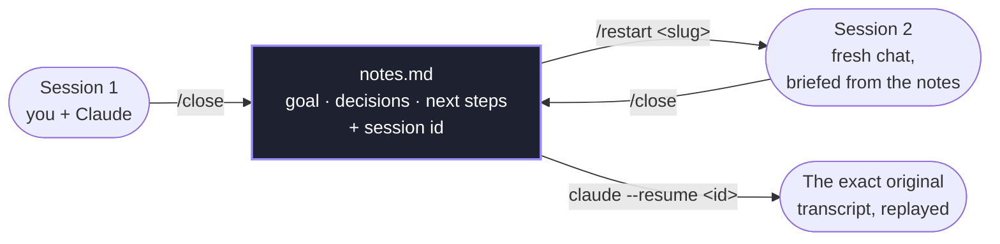

# Guide

A short tour of how AI Agents Orchestrator thinks — so the buttons and tabs make sense.

## The mental model

A **session** is one Claude Code conversation, working in one folder — a ticket, a feature, an experiment. You usually have several going at once.

- **You** run the skills (`/start`, `/close`, …) *inside Claude Code* to create and wrap up sessions.
- **The app** watches them all and shows you what's happening. It only *reads* your files — it never creates or moves your folders. (The launcher buttons just trigger the skills for you.)

Each session keeps a **`notes.md`** next to its code: the goal, key decisions, next steps, and a short history. That file is the session's memory — it's what lets you walk away and pick up cleanly later.

## The four states

Every session is in exactly one state. The tabs map to them:

| State | Means | Where |
|---|---|---|
| **Active** | A Claude Code session running right now. | Running |
| **Stale** | Still open, but its window is gone — you left without wrapping up. A nudge to finish or close it. | Running (grey dot) |
| **Closed** | Wrapped up with `/close`. Done for now, summarised in its notes. | Closed |
| **Archived** | Put away with `/archive` to declutter. The notes file stays on disk. | Archived |

So **Closed** = "finished and tidied", **Archived** = "finished and filed away", **Stale** = "still open but unattended".

## Start vs Resume vs Restart — the three ways in

The one thing worth getting straight:

- **Start** — begin a **brand-new** session (fresh folder + notes). Nothing existed before.
- **Resume** — continue an **existing** conversation *exactly* where it stopped; Claude replays the full history. Needs that recorded history to still be around.
- **Restart** — reopen a session from its **notes** in a **fresh** conversation. You get the full plan back *plus* the recorded **session id of the original**, so the new chat knows the whole story and the link back to the old conversation is never lost. Use it for a clean slate that still remembers everything.

> Rule of thumb: **Resume** = same conversation · **Restart** = same project, fresh conversation, history still linked · **Start** = new project.

Each can open **in the app's embedded terminal** or **in your own terminal** — your choice, with the toggle next to the button.

## Why this matters: notes that beat "compaction"

Long AI sessions hit a wall. To keep going, the assistant **compacts** its own history — squeezing or quietly dropping older turns. It's silent and lossy: a decision from day one, *why* you picked a branch, that one ticket link — any of it can fall out of the window, and the model loses the thread.

This app sidesteps that by keeping the important stuff **on disk**, not just in the conversation:

- **`/close`** writes the durable record into `notes.md` — goal, decisions, files touched, open questions, next steps — and stamps a **Session history** line tagged with that conversation's **session id**.
- **`/restart`** reads it back into a *fresh* conversation. You get the notes **and** every past session id, so the chain from today's work back to the original conversation is never broken.
- Need the *exact* original transcript? Because the session id is recorded, you can always `claude --resume <id>` and replay it verbatim.

Nothing important gets compacted away, because the source of truth is a **file you own** — not a context window. Everything stays linked: **notes → session id → transcript.**

| Step | Command | What it preserves | Lives where |
|---|---|---|---|
| **Wrap up** | `/close` | Goal, decisions, files, open questions, next steps — **+ the session id** | `notes.md`, on disk |
| **Pick back up (fresh)** | `/restart <slug>` | All of the above, loaded into a new conversation — **+ the link to past sessions** | new session, notes re-loaded |
| **Replay verbatim** | `claude --resume <id>` | The **entire** original transcript, turn for turn | Claude Code's own history |

## The skills

You run these inside Claude Code (the dashboard buttons trigger them for you). Categories and folder locations come from your shared config.

| Skill | What it does |
|---|---|
| **`/start <CATEGORY> <ticket> <name>`** | Creates the session: a workspace + `notes.md` under the category's folder, registers it, and syncs the git repo. |
| **`/close`** | Wraps up the current session — summarises what you did into `notes.md` and stamps a history entry **tagged with the session id**. → *Closed* |
| **`/restart <slug>`** | Reloads a session's notes **and its recorded session id** into a fresh conversation, and checks out its branch — so the history stays linked (and `claude --resume` still works). |
| **`/archive <slug>`** | Marks a session archived and drops it from the active list (the notes file is kept). → *Archived* |
| **`/rename-category <OLD> <NEW>`** | Renames a category everywhere — moves its folder, re-tags every `notes.md`, updates the config. (The app is read-only, so renaming *there* alone would orphan sessions — this skill does the real move.) |

## A typical day

1. **`/start FEAT 1842 checkout-redesign`** → new session, ready to work.
2. Work with Claude; the dashboard shows it as **Active**, and flags it **waiting** when it needs you.
3. **`/close`** when you're done for the day → it moves to **Closed**, notes summarised.
4. Tomorrow, **Restart** it from the dashboard → fresh conversation, full context from the notes.
5. Shipped? **Archive** it to clear it out — the folder and notes stay on disk.
