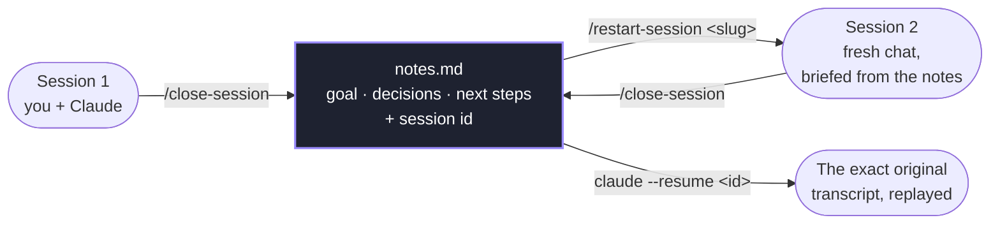

# Guide

A short tour of how AI Agents Orchestrator thinks — so the buttons and tabs make sense.

## The mental model

A **session** is one Claude Code conversation, working in one folder — a ticket, a feature, an experiment. You usually have several going at once.

- **You** run the skills (`/start-session`, `/close-session`, …) *inside Claude Code* to create and wrap up sessions.
- **The app** watches them all and shows you what's happening. It only *reads* your files — it never creates or moves your folders. (The launcher buttons just trigger the skills for you.)

Each session keeps a **`notes.md`** next to its code: the goal, key decisions, next steps, and a short history. That file is the session's memory — it's what lets you walk away and pick up cleanly later.

## The four states

Every session is in exactly one state. The tabs map to them:

| State | Means | Where |
|---|---|---|
| **Active** | A Claude Code session running right now. | Running |
| **Stale** | Still open, but its window is gone — you left without wrapping up. A nudge to finish or close it. | Running (grey dot) |
| **Closed** | Wrapped up with `/close-session`. Done for now, summarised in its notes. | Closed |
| **Archived** | Put away with `/archive-session` to declutter. The notes file stays on disk. | Archived |

So **Closed** = "finished and tidied", **Archived** = "finished and filed away", **Stale** = "still open but unattended".

## Start vs Resume vs Restart — the three ways in

The one thing worth getting straight:

- **Start** — begin a **brand-new** session (fresh folder + notes). Nothing existed before.
- **Resume** — continue an **existing** conversation *exactly* where it stopped; Claude replays the full history. Needs that recorded history to still be around.
- **Restart** — reopen a session from its **notes** in a **fresh** conversation. You get the full plan back *plus* the recorded **session id of the original**, so the new chat knows the whole story and the link back to the old conversation is never lost. Use it for a clean slate that still remembers everything.

  The dashboard offers Restart **only when Resume cannot run** — no session id, or the transcript is gone. Where Resume works it is strictly better, and a compaction already gives you a fresh context. The skill stays available by hand whenever you want a clean slate.

> Rule of thumb: **Resume** = same conversation · **Restart** = same project, fresh conversation, history still linked · **Start** = new project.

> Whichever you use, the terminal opens at the **root of the session's space** — the folder you picked for that space in Settings. One rule for every session, so moving a space moves its sessions with it.

Each can open **in the app's embedded terminal** or **in your own terminal**, with the toggle next to the button.

**Prefer the embedded one.** The whole point of the app is to stop juggling a dozen
terminal windows: every session gets its own terminal *inside* the app, and switching
sessions is a click. Opening in your own terminal still works — but you're back to
hunting for the right window, which is the problem this replaces.

## Bringing in sessions you started outside the app

Sessions you started yourself (plain `claude` in a shell) aren't managed: they have no
`notes.md`, so the app can't track them. **First-run setup** brings them in — three steps:

1. **Spaces and categories** — the folders your notes live under, and the colour-coded
   buckets inside them. This comes first because an import needs a category to file into.
   The same step sets each space's **knowledge-notes folder**, your **ticket tracker URL**
   (which turns a ticket key on a card into a link) and the **card density**, the last with
   a live sample card so you pick by looking rather than by reading. All three are optional,
   and all three are in Settings afterwards.
2. **Your sessions** — tick the ones you still work on and say where each one belongs; the
   newest few are ticked for you. **▸ Preview** on a row shows what that session opened with
   and what it left off at, so you can tell which ones are still worth keeping. The line
   underneath accounts for what the scan left out — transcripts already in the app, and
   automation runs like the ones behind the Sync button.
3. **Import** — the one step that writes. Each session resumes briefly to write its own
   notes, so it takes a moment per session, and each row reports its own result.

It runs itself once, on an install with nothing in it. After that — or if you skipped it —
**Settings → First-run setup → Re-run first-time setup…** opens it again, and the list's
empty state offers it too.

This is the *only* place the dashboard adopts a session started elsewhere, and that is
deliberate: once a session is tracked you are meant to start the next one from **＋ New**,
not from a shell. Importing is a one-time step — afterwards a session behaves like any
other, so you just Resume it.

## Git is optional, and no worktree is ever involved

A tester bounced off this one, so it is worth stating plainly: **the dashboard does not use
`git worktree`, and it never creates one.** If a session happens to run inside a linked
worktree it shows a "Worktree" row in the detail panel — an observation, nothing more. Work
in a plain clone and that row simply never appears.

The confusion comes from the word *workspace*, which this guide used to use. A session's
folder — `<space>/<CATEGORY>/<slug>/` — holds **only its `notes.md`**. It is a notes folder,
not a checkout: your repo stays exactly where it is, nothing is copied, duplicated or
checked out.

**What decides whether git runs is not the Branch field — it is whether the session starts
inside a repo.** The session's launch directory is the **Start in** field when you give one,
and the space's root folder otherwise. **Start in** accepts *any* folder — a checkout, a
notes tree, a scratch directory — so picking one outside every repo is how you say "open
here, and leave git alone".

- **Launch directory is not inside a git repo** — git is skipped entirely. Nothing is
  fetched, checked out or rebased. This is the normal case, because a space's root is
  usually a notes folder.
- **Launch directory IS inside a repo** — session start records the branch (the one you
  typed, checked out with `git checkout <branch> --`, or else whatever branch you were
  already on), runs `git fetch --all --prune`, then attempts up to two rebases:
  **`git rebase origin/<branch>`**, but only if that branch exists on `origin`, and
  **`git rebase origin/<default-branch>`** whenever your branch is not the default one. So a
  local-only branch skips the first and still gets the second. A rebase that conflicts is
  aborted and reported, never left half-applied.

Read that second case twice if you keep long-lived local work on one branch: **pointing
Start in at a checkout is enough to trigger the rebase, even with the Branch field left
blank**, because the branch is then read from that checkout. If you would rather drive git
yourself, point **Start in** somewhere outside any repo, or leave it blank — the session
still gets its notes, its category and its terminal, and your checkout is never touched.
Only **Branch** still requires a git checkout, since there is otherwise nothing to check it
out in.

## One session, one process

Resuming a session doesn't attach to a running one: `claude --resume` starts a **second
process** on the same conversation, and from there the two diverge. If the app warns you
that a session is already running, take **Reveal window** to jump to the existing one
rather than *Open anyway* — the warning exists precisely to stop you forking your own work.

## Why this matters: notes that beat "compaction"

Long AI sessions hit a wall. To keep going, the assistant **compacts** its own history — squeezing or quietly dropping older turns. It's silent and lossy: a decision from day one, *why* you picked a branch, that one ticket link — any of it can fall out of the window, and the model loses the thread.

This app sidesteps that by keeping the important stuff **on disk**, not just in the conversation:

- **`/close-session`** writes the durable record into `notes.md` — goal, decisions, files touched, open questions, next steps — and stamps a **Session history** line tagged with that conversation's **session id**.
- **`/restart-session`** reads it back into a *fresh* conversation. You get the notes **and** every past session id, so the chain from today's work back to the original conversation is never broken.
- Need the *exact* original transcript? Because the session id is recorded, you can always `claude --resume <id>` and replay it verbatim.

Nothing important gets compacted away, because the source of truth is a **file you own** — not a context window. Everything stays linked: **notes → session id → transcript.**


```mermaid
flowchart LR
    S1(["Session 1<br/>you + Claude"]) -->|/close-session| N["notes.md<br/>goal · decisions · next steps<br/>+ session id"]
    N -->|"/restart-session &lt;slug&gt;"| S2(["Session 2<br/>fresh chat,<br/>briefed from the notes"])
    N -->|"claude --resume &lt;id&gt;"| R(["The exact original<br/>transcript, replayed"])
    S2 -->|/close-session| N
    classDef disk fill:#1e2230,stroke:#9b8cff,stroke-width:2px,color:#fff;
    class N disk;
```

| Step | Command | What it preserves | Lives where |
|---|---|---|---|
| **Wrap up** | `/close-session` | Goal, decisions, files, open questions, next steps — **+ the session id** | `notes.md`, on disk |
| **Pick back up (fresh)** | `/restart-session <slug>` | All of the above, loaded into a new conversation — **+ the link to past sessions** | new session, notes re-loaded |
| **Replay verbatim** | `claude --resume <id>` | The **entire** original transcript, turn for turn | Claude Code's own history |

## The skills

**These are what actually does the work.** The dashboard's buttons — ＋ New, Resume,
Restart, Close, Sync, Archive — are launchers: each opens Claude Code on one of the skills
below, and the *skill* creates the folder, writes the `notes.md`, registers the session or
files it away. The app deliberately never writes those itself, so that what you see is
always what is really on disk. Install the app without the skills and the buttons open a
session that does nothing.

You can also run every one of them by hand, in any Claude Code session. Categories and
folder locations come from your shared config, so the skills and the app always agree.

### Where they live

In your normal skills folder, as normal skills:

```
~/.claude/skills/
├── start-session/ close-session/ …   the 14 this app ships
├── lib/aoconfig.py                   shared helper that reads your config
├── .ao-base/<name>/                  pristine copy, to tell "you edited it" from "it's old"
├── .archive/<name>.pre-sync-…/       your version, kept, if one is ever replaced
└── anything else you have            never touched
```

**Installing or updating them cannot affect your own skills.** Both the installer script and
the app's launch sync work through the 14 names this app ships; everything else in that
folder is invisible to them. The single exception is a skill of yours that happens to share
one of those names — that one is replaced, after your version is copied into `.archive/` and
named on screen.

`bash scripts/install.sh --all` installs everything: this app's skills, refreshed to the
version you have checked out, plus the two optional hooks. Without `--all` (or `--force`) a
skill you already have is kept rather than replaced, and the installer tells you which
updates it therefore withheld.

| Skill | What it does |
|---|---|
| **`/start-session <CATEGORY> <ticket> <name>`** | Creates the session: a folder holding its `notes.md` under the category's folder, registers it, and — only when that folder is inside a git repo — fetches and rebases the branch onto `origin`. It reads the branch from the checkout when you did not name one, so what triggers git is being inside a repo, not the Branch field. |
| **`/close-session`** | Wraps up the current session — summarises what you did into `notes.md` and stamps a history entry **tagged with the session id**. → *Closed* |
| **`/save-session`** | Checkpoints the active session into `notes.md` mid-flight, marked `(in progress)`, **without** closing it — handy before a context compaction. Stays *Running*. |
| **`/restart-session <slug>`** | Reloads a session's notes **and its recorded session id** into a fresh conversation, and checks out its branch — so the history stays linked (and `claude --resume` still works). |
| **`/archive-session <slug>`** | Marks a session archived and drops it from the active list (the notes file is kept). → *Archived* |
| **`/wrap-session <notes> <id>`** | The headless twin of `/close-session`, behind the dashboard's **Close** button: it summarises and closes without opening a terminal. |
| **`/sync-refs <notes>`** | Realigns one session's references — each ticket's current status from your tracker, and any pull request whose branch names one of its tickets. Behind the **Sync** button. |
| **`/import-session <CATEGORY> [name]`** | Binds the session you are in to a `notes.md` under a chosen space and category, and registers it. This is what first-run setup runs for each session you tick. |
| **`/rename-category <OLD> <NEW>`** | Renames a category everywhere — moves its folder, re-tags every `notes.md`, updates the config. (The app does not move folders, so renaming *there* alone would orphan sessions — this skill does the real move.) |
| **`/skill-propose`** | Turns what this session taught into a reusable skill — or, preferably, a patch to one you already have. Only fires when something reusable actually came up. With you there it shows the **exact wording** it would change and applies it on your yes; otherwise it stages the proposal for `/skills-review`. Every change is appended to `~/.claude/skills-applied.log`, which is how you undo one. |
| **`/skills-review`** | Shows a staged proposal (full content, or a real diff) and promotes it only once you approve. Where a proposal lands when nobody was there to answer it — a headless close, a background run. |
| **`/skills-curate`** | Occasional housekeeping over the whole set: refreshes per-skill usage from your transcripts, flags what has gone dormant, and proposes merging skills that should be one. Never deletes — archives. |
| **`/learn`** | Records one durable fact — a preference you stated, an environment quirk, a gotcha and its workaround — into this space's knowledge notes, **as it happens**. Waiting for the session close means the write often never happens. |
| **`/route <ticket \| topic>`** | A Context Brief *before* you investigate: this space's knowledge notes, your past session notes and — when a tracker is reachable — its tickets, summarised. Read-only. Run it at the start of a bug or an unfamiliar area, not after getting stuck. |

## A typical day

0. First time only: **first-run setup** names your spaces, categories and colours, points a space at a knowledge-notes folder if you want one, and brings in the sessions you already had.
1. **`/start-session FEAT 1842 checkout-redesign`** → new session, ready to work.
2. Work with Claude; the dashboard shows it as **Active**, and flags it **waiting** when it needs you.
3. **`/close-session`** when you're done for the day → it moves to **Closed**, notes summarised.
   Closed the terminal and forgot? The **Close** button on a stale session does the same thing headlessly — it resumes the session in the background, writes the summary and attaches the PRs, without opening anything.
4. Tomorrow, **Restart** it from the dashboard → fresh conversation, full context from the notes.
5. Shipped? **Archive** it to clear it out — the folder and notes stay on disk.
